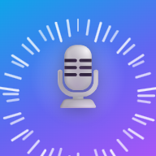

<div align="center">



# Norsk uttale

**Say Norwegian out loud. See your intonation, phoneme by phoneme.**

[**▶ Open the app**](https://sushantsriv.github.io/norwegian-pronunciation-app/) · Free · No sign-up · Runs entirely in your browser

</div>

---

Most pronunciation apps tell you *whether* you were right. This one shows you **why**,
including the thing that most often gives a non-native speaker away in Norwegian:
**melody**.

Norwegian is a *pitch-accent* language. Speaking it with flat, English-style intonation
is instantly recognisable — and virtually no learning app measures it. This one records
your attempt, extracts the pitch contour, and draws it.

## What it does

| | |
|---|---|
| 🎙️ **On-device recognition** | A quantized Whisper model runs inside the page itself. Every word is aligned and scored, so a dropped or inserted word does not throw off everything after it. |
| 🔤 **Phoneme feedback** | Each missed word is broken into IPA sounds, with a plain-language explanation of the target sound and what you actually said. |
| 📈 **Melody scoring** | Your pitch contour, normalised to semitones and aligned to the *expected* shape for that word's tonelag by dynamic time warping — so a correctly shaped but unhurried delivery scores as correct. Flat delivery scores zero, by construction. |
| 🎵 **Which tonelag you actually said** | Not just a mark out of 100. The chart names the accent your delivery fits: *"that came out as Tonelag 1, but this word takes Tonelag 2"*. It refuses to guess — a flat attempt sits equidistant from both shapes, so it says nothing rather than something untrue. |
| 👯 **Tone twins** | 106 words in the corpus are two different words that only the melody separates — `huset` the house against `huset` housed, `avtale` the noun against the verb. When you get one, the app says so and names both. |
| 🗣️ **Dialects** | Østnorsk, Vest-/sørvestnorsk or Trøndersk/nordnorsk. The transcription under every phrase updates live, so the choice is visible rather than buried in error feedback. |
| 🎧 **Listen back** | Play the reference and your own attempt back to back. Silence before and after you speak is trimmed automatically. |
| 🎯 **Rising difficulty** | Clear 10 phrases before losing 3 lives. The pass bar climbs with every one you get right. |
| 📚 **13 tracks** | Five CEFR levels from A1 words to B2 clusters, plus eight occupation tracks — helse, bygg, barnehage, butikk, restaurant, transport, renhold, kontor. |

Your voice never leaves your browser: not the recording, not the transcript, not the
score. Recognition runs as a local model rather than a cloud service, so that is a
property of the architecture rather than a promise.

## Requirements

- **A desktop browser built on Chromium or WebKit** — Chrome, Edge, Safari. Both engines are measured (see below). Recognition is a quantized Whisper model running in the page on WebAssembly rather than a browser API, so nothing is locked out by policy — but "not locked out" is not the same as "measured", and only what has been measured is claimed here.
- **About 82 MB on first use**, downloaded once and then cached: a quantized whisper-base (76 MB) plus the ONNX Runtime it runs on (5.7 MB gzipped). After that recognition works with the network off. The rest of the app is ~1.9 MB.
- **A Norwegian text-to-speech voice** for the reference audio. Most systems have one; the app tells you how to add one if not.
- **Roughly 2.3x the length of what you said**, while the model transcribes: a two-second phrase comes back in about four and a half seconds on a desktop Chromium, five and a half on WebKit. Longer on an older or smaller device. That is the cost of not sending your voice anywhere.

## Install it

It is a PWA, so you can add it to your home screen or desktop and use it offline:
open the app and choose **Install** from the address bar or menu. Recognition works offline
once the model has been fetched once.

## Running it yourself

```bash
npm install
npm run dev        # http://localhost:5173
npm test           # 184 unit tests
npm run build      # production build
```

There is no backend to run and no API key to hold. Everything — speech recognition, word
alignment, Norwegian grapheme-to-phoneme conversion, compound splitting, pitch detection
and melody alignment — happens client-side in TypeScript.

<details>
<summary><strong>Optional: the original FastAPI backend</strong></summary>

`backend/` still holds the original Whisper-based scoring service, running a full-size
model server-side. The browser now runs Whisper too, just a much smaller checkpoint, so
what the backend still buys you is accuracy rather than capability. It is not what the
hosted app uses.

```bash
cd backend
pip install -r requirements.txt
uvicorn main:app --reload --port 8000
```

| Variable | Default | Purpose |
|---|---|---|
| `WHISPER_MODEL_SIZE` | `small` | Whisper model to load |
| `ALLOWED_ORIGINS` | `http://localhost:5173` | CORS allow-list |
| `MAX_UPLOAD_BYTES` | 15 MB | Upload size cap |

</details>

<details>
<summary><strong>Optional: analytics</strong></summary>

The app ships with **no tracking**. Set `VITE_ANALYTICS_URL` at build time to enable a
cookie-less page counter (GoatCounter, Plausible, etc.). Do Not Track is respected and no
identifiers are stored. Recordings are never sent to any analytics endpoint.

Speech **recognition** used to be the exception to this: it was performed by the browser's
own service, which meant the audio went to Google's, Microsoft's or Apple's servers. It now
runs as a local model on ONNX Runtime Web, so the recording, the transcript, the scoring and
the pitch analysis never leave the device.

</details>

## How the scoring works

1. A quantized **whisper-base** transcribes the recording, in a web worker, on your own
   device. The clip is checked for actual speech first: given silence Whisper does not
   return nothing, it returns whatever its language model finds likely.
2. Expected and heard words are **aligned** with Needleman–Wunsch, so inserted or
   dropped words do not cascade into false errors.
3. Each mismatched word is converted to IPA — from the NB Uttale lexicon where it is
   covered, by splitting it into known compound members where it is not, and by a
   rule-based G2P otherwise — then compared by normalised edit distance, so a near-miss
   scores higher than a completely wrong word.
4. Per-word scores roll into one 0–100 composite, which the rising pass bar tests.
5. Your recording is separately run through autocorrelation **pitch detection**,
   normalised to semitones against your own median pitch, and aligned to the target
   contour by **dynamic time warping** before being scored.

The same alignment answers a second and more useful question: which of the two accents
does this delivery actually fit? Scoring against one target needs an absolute threshold on
stylised curves; asking which of two it is *closer* to is a relative decision, and relative
decisions survive the noise of a phone microphone. It is also the question the language
poses — `hender` is either hands or happens, and the melody is the entire difference — so
you get "you said the hands one" rather than "41/100".

Before any of that, two things the transcript gets to spell its own way are reconciled, so
neither costs you a life. Whisper transcribes rather than dictates, so `fem` comes back as
`5` while the corpus spells it out; number words and digits canonicalise to the same token,
and a digit is given its pronunciation back before the phoneme comparison. And Norwegian
compounds come back written apart as often as together — `skiftetøy` heard as `skifte tøy`
— which alignment would charge as a substitution plus an insertion. Both are rejoined only
towards words the phrase actually asked for, so neither can invent a match.

Two normalisations are what make the melody score mean anything. Semitones
(`ST = 12·log₂(F₀ / F₀ median)`) remove the speaker: a bass at 100 Hz and a soprano at
200 Hz saying the same word share a shape and no frequencies at all. DTW removes the
clock: a learner is usually slower than the reference, and comparing frame-for-frame
would mark a correctly shaped delivery wrong. What is left is the shape of the melody,
which is what pitch accent actually is. The score is expressed against a flat baseline,
so 0 means "no closer to the target than not trying" — the exact failure mode the chart
exists to catch.

### Measured, in real browsers

`npm run bench:browser` drives the app's own worker and pitch code in Playwright
and reports what it costs. On a desktop Windows machine, a 2-second clip:

| engine | model load (cold) | transcribe | x real time | pitch analysis | JS heap |
|---|---|---|---|---|---|
| Chromium | 7.9 s | 4.64 s | 2.31 | 0.05 s | 10 MB |
| WebKit | 9.2 s | 5.55 s | 2.82 | 0.04 s | not reported |
| Firefox | under investigation | | | | |

Chromium is the engine behind Chrome and Edge and WebKit the engine behind
Safari, so those numbers transfer in kind — they are not the branded builds.
**Chrome on Android and Safari on iOS are not covered at all**: they need real
devices, and nothing here should be read as evidence about them.
`bench/bench.html` is a plain page, so opening it through `npm run dev` on a
phone produces the same table.

That benchmark earned its keep immediately. The quantized model did not load in
any browser — a graph-rewrite failure in ONNX Runtime Web that does not happen
under Node, where every earlier measurement had been taken — so recognition had
shipped completely broken, invisibly to every test in this repository.

**Known limits:** whisper-base is a small model and will mis-hear a learner sometimes,
which shows up as a low score they did not earn. `scripts/bench-asr.mjs` measures exactly
that against read Norwegian from google/fleurs, and the model was picked on those numbers
rather than on size — `tiny` scored 79% word error rate against `base`'s 48%, which in a
pronunciation app means failing attempts that were correct. Since it will mis-hear
people, an attempt is judged before it is scored: when the recognised words account for
less than 40% of the speech actually measured in the recording, the attempt is called
uncertain, costs no life and is offered again. That check uses only evidence from the
audio, never a guess from the transcript, because whether a wrong transcript means the
model failed or the learner said something else is not decidable from text — and a
heuristic that tried would excuse real mistakes. The fallback G2P used outside the
lexicon is an approximation and will be wrong on loanwords. Pitch detection returns
nothing rather than guessing on unvoiced or quiet frames. The melody target is drawn for
single words only, since a phrase has one accent per word.

## Yrkesnorsk

Alongside the five CEFR stages there are eight occupation tracks — the sectors
where Norwegian learners most often actually work:

| | |
|---|---|
| 🏥 Helse og omsorg | pain, medication, next of kin, discharge |
| 🏗️ Bygg og anlegg | scaffolding, protective gear, drawings, safety |
| 🧸 Barnehage og skole | parents, outdoor clothes, pick-up times |
| 🛒 Butikk og service | receipts, returns, opening hours |
| 🍽️ Restaurant og kjøkken | orders, allergies, closing time |
| 🚚 Transport og logistikk | loads, routes, paperwork |
| 🧼 Renhold | products, equipment, finishing a shift |
| 💻 Kontor og IT | access, deadlines, screen sharing |

Occupation vocabulary gets the same IPA, tonelag and phoneme feedback as the general
corpus. Words like `skiftetøy`, `hentetid` and `tørkepapir` are ordinary Norwegian
compounds that no lexicon can enumerate, because Norwegian forms compounds freely and
writes the result as one word. They are now **split into members the lexicon does
know** — `skifte + tøy`, `hente + tid` — and reassembled with the compound's own stress
and pitch accent, instead of falling back to the rule engine whose weakest point was
exactly that.

## Pronunciation data

Pronunciation and pitch-accent data comes from **[NB Uttale](https://www.nb.no/sprakbanken/en/resource-catalogue/oai-nb-no-sbr-79/)**,
the Norwegian Language Bank's pronunciation lexicon, published by
Nasjonalbiblioteket under **[CC0](https://creativecommons.org/publicdomain/zero/1.0/)**
(public domain). Credit is given because it is deserved, not because CC0 requires it.

It supplies, per word and per dialect area:

- broad IPA with stress and syllable structure
- **tonelag** — pitch accent 1 vs 2, which is what `bønder` (farmers) and
  `bønner` (beans) differ by, and nothing else
- part of speech, which separates senses such as `avtale` the noun (accent 2)
  from `avtale` the verb (accent 1)

`scripts/build-pronunciation.mjs` filters the 785,000-word source down to the
1,779 words this app actually uses, across both corpora. Each dialect group is a
lazy-loaded chunk, so picking one costs a single ~20 KB gzipped fetch. The script
also emits `parts.<dialect>.json` (3 KB gzipped) — the sub-words needed to
decompose whatever compounds remain unresolved — which the app loads alongside it.

NB Uttale distinguishes five areas, but across this corpus two pairs transcribe
**identically** — west matches southwest, and north matches Trøndelag — so they
are offered as three groups rather than five choices that would change nothing
when selected. The build script detects and skips those duplicates. East differs
from west/southwest on 176 of 1,625 words, and from Trøndelag/north on just 16.

### Coverage

| Source | Words | Share |
|---|---|---|
| NB Uttale, directly | 1,625 | 91.3% |
| Compound decomposition into NB Uttale members | 75 | 4.2% |
| Rule engines | 79 | 4.4% |

**95.6% of the corpus is backed by real pronunciation data.** It used to be 68%,
and the gap was not NB Uttale's: the build script only ever read `sentences.json`,
never `occupations.json`, so all 414 occupation-only words shipped with no lexicon
entry at all — the data existed, nothing asked for it.

The 79 words still on the rule engines are almost entirely English technical
vocabulary that appears in the Kontor og IT track — *agile*, *governance*,
*benchmarking*, *dashboards*, *tokens*. NB Uttale does not have them because they
are not Norwegian words, so that is the honest floor rather than a gap to close.
Those rules are demonstrably weaker than real data — the accent heuristic gets
`mistet` and `morgen` wrong — which is exactly why the lexicon is preferred
wherever it reaches.

### Compound pitch accent

The rule for compounds was derived from the data rather than taken from a textbook.
"Compounds take accent 2" is the usual line, and against the 351 marked compounds in
the east chunk it is wrong often enough to matter:

| First member | Accent | Evidence |
|---|---|---|
| Polysyllabic | its own | `data` is accent 1, so `datasett`, `datalagring` and `dataanalyse` all are |
| Monosyllabic + `-s-` | 1 | `tidsbruk`, `tidspunkt`, `tidsskrift`, `driftskostnader`, `kravspesifikasjoner` — 5 of 5 |
| Monosyllabic, no link | 2 | `sollys`, `matvarer`, `halvtime`, `grunnlag`, `språkkompetanse` — 21 of 21 |

Predicting the recorded tone of lexicon compounds from their members alone gets
**85%** (106/125). Prefixed words — `tilpasning`, `oppdatering`, `forberedelse` — are
deliberately kept off this path: they look like compounds and behave nothing like
them, since `oppgave` is accent 2 and `oppdatering` accent 1, so the accent is lexical
and there is nothing structural to derive.

Two further guards stop the splitter over-generating, which is the failure mode of
every compound splitter. A member must contain a vowel, because NB Uttale lists
spelled-out abbreviations and without it `dashboards` came apart as
`dash + boa + rds`. And a three-way split is only taken when no two-way one exists
and every member is at least four letters: `grunnpillarer` otherwise reads as
`grunn + pilla + rer`, where every fragment is a real Norwegian word, while genuine
three-part compounds like `smart + hjem + enheter` are built from substantial ones.

## Feedback

Found a bug or a phrase that scores wrongly?
[Open an issue](https://github.com/SushantSriv/norwegian-pronunciation-app/issues/new).

## Licence

**All rights reserved.** This is source-available, not open source — see
[LICENSE](LICENSE). You may read the code; you may not use, copy, modify or
redistribute it without written permission. Contact me if you would like to.
