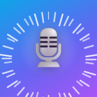

<div align="center">



# Norsk uttale

**Say Norwegian out loud. See your intonation, phoneme by phoneme.**

[**▶ Open the app**](https://sushantsriv.github.io/norwegian-pronunciation-app/) · Free · No sign-up · Runs entirely in your browser

</div>

---

Most pronunciation apps tell you *whether* you were right. This one shows you **why**,
including the thing that most often gives a non-native speaker away in Norwegian:
**melody**.

Norwegian is a *pitch-accent* language. Speaking it with flat, English-style intonation
is instantly recognisable — and virtually no learning app measures it. This one records
your attempt, extracts the pitch contour, and draws it.

## What it does

| | |
|---|---|
| 🎙️ **Recognition** | Your browser's own speech service transcribes; everything after that runs here. Every word is aligned and scored, so a dropped or inserted word does not throw off everything after it. |
| 🔤 **Phoneme feedback** | Each missed word is broken into IPA sounds, with a plain-language explanation of the target sound and what you actually said. |
| 📈 **Melody scoring** | Your pitch contour, normalised to semitones and aligned to the *expected* shape for that word's tonelag by dynamic time warping — so a correctly shaped but unhurried delivery scores as correct. Flat delivery scores zero, by construction. |
| 🎵 **Which tonelag you actually said** | Not just a mark out of 100. The chart names the accent your delivery fits: *"that came out as Tonelag 1, but this word takes Tonelag 2"*. It refuses to guess — a flat attempt sits equidistant from both shapes, so it says nothing rather than something untrue. |
| 👯 **Tone twins** | 106 words in the corpus are two different words that only the melody separates — `huset` the house against `huset` housed, `avtale` the noun against the verb. When you get one, the app says so and names both. |
| 🗣️ **Dialects** | Østnorsk, Vest-/sørvestnorsk or Trøndersk/nordnorsk. The transcription under every phrase updates live, so the choice is visible rather than buried in error feedback. |
| 🎧 **Listen back** | Play the reference and your own attempt back to back. Silence before and after you speak is trimmed automatically. |
| 🎯 **Rising difficulty** | Clear 10 phrases before losing 3 lives. The pass bar climbs with every one you get right. |
| 📚 **13 tracks** | Five CEFR levels from A1 words to B2 clusters, plus eight occupation tracks — helse, bygg, barnehage, butikk, restaurant, transport, renhold, kontor. |
| 👥 **Øv sammen** | Open a room, send the link, and do the conversation task with a real second candidate. Audio goes directly between the two browsers; nothing of it touches a server. |
| 🎓 **Prøverommet** | A rehearsal of Norskprøven's oral exam at all three levels — the examiner's real lines read aloud, the real task order, the published clock. It scores nothing and says so: you get your transcript back and no number. See below. |
| 🏆 **Learning points** | Points for clearing your own level's bar, for beating your own best on a word, for mastering one, and for coming back tomorrow — with caps that make repeating an easy phrase worthless. See below. |

**Recognition is your browser's own speech service.** The recording — and only the
recording — goes to Google, Microsoft or Apple to be transcribed, exactly as on any site
using the browser's speech API.

The app used to carry a quantized Whisper checkpoint and do it here instead. That is gone.
A 73 MB download bought a model that mis-heard people, and a pronunciation app that marks
a correct attempt wrong is not protecting anybody — it teaches them to distrust the score,
which is the end of its usefulness.

**Everything after the transcript still runs on your device**: alignment, phoneme scoring,
Norwegian G2P, pitch detection and melody, all on audio this app recorded itself. Nothing
is stored anywhere but your browser.

**What it cost, plainly.** Firefox has never enabled its speech service, so the app cannot
work there and says so instead of pretending. Offline practice is gone, because the
service needs a network. And per-word melody is gone, because the service reports no word
timings — whole-word melody, measured from the recording, is unaffected and is still the
point of the app.

## Requirements

- **A browser with a speech recognition service** — Chrome, Edge or Safari. **Firefox does not have one** and the app cannot work there; it says so rather than offering a microphone button that does nothing.
- **A network connection**, because recognition is a service rather than something carried in the page.
- **About 2 MB**, once. There is no model to download any more.
- **A Norwegian text-to-speech voice** for the reference audio. Most systems have one; the app tells you how to add one if not.
- **Roughly 2.3x the length of what you said**, while the model transcribes: a two-second phrase comes back in about four and a half seconds on a desktop Chromium, five and a half on WebKit. Longer on an older or smaller device. That is the cost of not sending your voice anywhere.

## Install it

It is a PWA, so you can add it to your home screen or desktop: open the app and choose
**Install** from the address bar or menu. The app shell is cached and opens instantly, but
practising needs a connection, because transcription is the browser's service.

## Running it yourself

```bash
npm install
npm run dev        # http://localhost:5173
npm test           # 454 unit tests
npm run build      # production build
```

There is no backend to run and no API key to hold. Everything — speech recognition, word
alignment, Norwegian grapheme-to-phoneme conversion, compound splitting, pitch detection
and melody alignment — happens client-side in TypeScript.

<details>
<summary><strong>Optional: the original FastAPI backend</strong></summary>

`backend/` still holds the original Whisper-based scoring service, running a full-size
model server-side. It is not what the hosted app uses, and it is the only way left to run
this without depending on a browser's speech service — worth knowing if that constraint
ever matters to you.

```bash
cd backend
pip install -r requirements.txt
uvicorn main:app --reload --port 8000
```

| Variable | Default | Purpose |
|---|---|---|
| `WHISPER_MODEL_SIZE` | `small` | Whisper model to load |
| `ALLOWED_ORIGINS` | `http://localhost:5173` | CORS allow-list |
| `MAX_UPLOAD_BYTES` | 15 MB | Upload size cap |

</details>

<details>
<summary><strong>Optional: analytics</strong></summary>

The app ships with **no tracking**. Set `VITE_ANALYTICS_URL` at build time to enable a
cookie-less page counter (GoatCounter, Plausible, etc.). Do Not Track is respected and no
identifiers are stored. Recordings are never sent to any analytics endpoint.

Speech **recognition** is the browser's own service, so the recording — and only the
recording — goes to Google, Microsoft or Apple to be transcribed, exactly as it does on
any site using the browser's speech API. There is no longer a second path: the on-device
model that used to offer one has been removed.

Everything after the transcript stays here. The scoring, the pitch analysis and the melody
all run on your device, and nothing is stored anywhere but your browser.

</details>

## How the scoring works

1. Your browser's **speech service** transcribes what you said, while a MediaRecorder
   captures the same audio for everything that follows. The recording is checked for
   actual speech, so silence is called silence rather than scored.
2. Expected and heard words are **aligned** with Needleman–Wunsch, so inserted or
   dropped words do not cascade into false errors.
3. Each mismatched word is converted to IPA — from the NB Uttale lexicon where it is
   covered, by splitting it into known compound members where it is not, and by a
   rule-based G2P otherwise — then compared by normalised edit distance, so a near-miss
   scores higher than a completely wrong word.
4. Per-word scores roll into one 0–100 composite, which the rising pass bar tests.
5. Your recording is separately run through autocorrelation **pitch detection**,
   normalised to semitones against your own median pitch, and aligned to the target
   contour by **dynamic time warping** before being scored.

The same alignment answers a second and more useful question: which of the two accents
does this delivery actually fit? Scoring against one target needs an absolute threshold on
stylised curves; asking which of two it is *closer* to is a relative decision, and relative
decisions survive the noise of a phone microphone. It is also the question the language
poses — `hender` is either hands or happens, and the melody is the entire difference — so
you get "you said the hands one" rather than "41/100".

Before any of that, two things the transcript gets to spell its own way are reconciled, so
neither costs you a life. A speech service transcribes rather than dictates, so `fem` can
come back as `5` while the corpus spells it out; number words and digits canonicalise to the same token,
and a digit is given its pronunciation back before the phoneme comparison. And Norwegian
compounds come back written apart as often as together — `skiftetøy` heard as `skifte tøy`
— which alignment would charge as a substitution plus an insertion. Both are rejoined only
towards words the phrase actually asked for, so neither can invent a match.

Two normalisations are what make the melody score mean anything. Semitones
(`ST = 12·log₂(F₀ / F₀ median)`) remove the speaker: a bass at 100 Hz and a soprano at
200 Hz saying the same word share a shape and no frequencies at all. DTW removes the
clock: a learner is usually slower than the reference, and comparing frame-for-frame
would mark a correctly shaped delivery wrong. What is left is the shape of the melody,
which is what pitch accent actually is. The score is expressed against a flat baseline,
so 0 means "no closer to the target than not trying" — the exact failure mode the chart
exists to catch.

### Measured, in real browsers

`npm run bench:browser` drives the app's own worker and pitch code in Playwright
and reports what it costs. On a desktop Windows machine, a 2-second clip:

| engine | model load (cold) | transcribe | x real time | pitch analysis | JS heap |
|---|---|---|---|---|---|
| Chromium | 7.9 s | 4.64 s | 2.31 | 0.05 s | 10 MB |
| WebKit | 9.2 s | 5.55 s | 2.82 | 0.04 s | not reported |
| Firefox | 13.6 s | 47.05 s | 23.52 | 0.06 s | not reported |

Pitch analysis is negligible everywhere — 40 to 60 ms for two seconds of audio —
so the wait a learner feels is essentially all speech model.

Chromium is the engine behind Chrome and Edge and WebKit the engine behind
Safari, so those numbers transfer in kind — they are not the branded builds.
**Chrome on Android and Safari on iOS are not covered at all**: they need real
devices, and nothing here should be read as evidence about them.
`bench/bench.html` is a plain page, so opening it through `npm run dev` on a
phone produces the same table.

**Known limits:** the browser's speech service will still mis-hear a learner sometimes,
which shows up as a low score they did not earn. `scripts/bench-asr.mjs` measures exactly
that against read Norwegian from google/fleurs, and the model was picked on those numbers
rather than on size — `tiny` scored 79% word error rate against `base`'s 48%, which in a
pronunciation app means failing attempts that were correct. Since it will mis-hear
people, an attempt is judged before it is scored: when the recognised words account for
less than 40% of the speech actually measured in the recording, the attempt is called
uncertain, costs no life and is offered again. That check uses only evidence from the
audio, never a guess from the transcript, because whether a wrong transcript means the
model failed or the learner said something else is not decidable from text — and a
heuristic that tried would excuse real mistakes. The fallback G2P used outside the
lexicon is an approximation and will be wrong on loanwords. Pitch detection returns
nothing rather than guessing on unvoiced or quiet frames. The melody target is drawn for
single words only, since a phrase has one accent per word.

## Hosting it somewhere else

The app is a static build and runs on any host. [`DEPLOYING.md`](DEPLOYING.md) is the
walk-through for putting it on a domain of your own via Cloudflare. The original reason
for moving was that Cloudflare can send the cross-origin isolation headers GitHub Pages
cannot — which mattered a great deal when a WASM model needed threads, and not at all now
that it is gone. What remains is an ordinary good reason: it is where the optional
leaderboard already runs, so the whole thing sits in one account.

The intended home is **saynorwegian.app** — `.app` is on the browsers' HSTS preload list,
so HTTPS is forced before a request is made, and `getUserMedia` refuses to run outside a
secure context. Link previews, the canonical URL and the leaderboard's allowed origins all
already name it.

The base path is an environment variable, so a root-served build is `VITE_BASE=/ npm run
build` rather than a code change. `npm run check:deploy -- https://your-domain` drives a
real browser against a deployment and checks the things that fail silently: the base path,
cross-origin isolation, the service worker, the manifest, and whether the model's CDN is
still reachable.

## Speed

There is no model to wait for. The app is about 2 MB and the first paint is immediate;
transcription is the browser's own service, whose latency is not this app's code to
measure.

It was not always so. The app used to carry a quantized whisper-base and run it on ONNX
Runtime Web, which meant a 73 MB download and, in Chromium, 6.41 s to transcribe on one
WASM thread against 2.96 s on four — the difference being whether the page was
cross-origin isolated, which GitHub Pages cannot do. A service worker was built to supply
those headers. All of it is gone, along with the model it existed to serve.

## Points, streaks and the leaderboard

Practising earns learning points. The design constraint was that the board must **not**
become a ranking of who has the most spare time, and must not put an A1 learner behind a
B1 learner for reasons that have nothing to do with either of them learning anything.

| Earned for | Points |
|---|---|
| An attempt the app was willing to judge | 5 |
| Clearing the stage's current bar | +5 |
| Clearing it by 12 points or more | +10 instead |
| A new personal best on a word (8 points or better) | 10–15 |
| A word reaching the seven-day review interval | 15, or 20 if you kept missing it |
| Finishing a run | 25 cleared, 10 out of lives |
| Every seventh consecutive day | 50 |

Three rules do the real work:

- **Clearing is measured against your own bar.** Each stage sets its own pass threshold —
  55 at A1, 66 at B2 — and it climbs as a run goes on. An A1 learner clearing an A1 bar
  earns what a B1 learner earns for clearing a B1 one, because both did what was asked of
  them. A level factor exists on top of that, and is capped at ten per cent, on purpose.
- **Improvement is paid on a personal best and nothing else.** Not on your last attempt,
  your best ever — so deliberately doing badly and then recovering pays nothing, and each
  payout raises the bar for the next one. A learner going 50 → 90 on a word earns more
  than one going 70 → 95, whatever level either is at.
- **Repetition decays.** A phrase pays full points three times a day. A phrase whose
  words you have already mastered pays 2. The day stops at 600 points, which is three
  committed sessions and nowhere near what grinding one phrase would need. Saying the
  same easy sentence five hundred times earns 45 points and then nothing.

"Most improved" is the change in your **median** score this week against last, and it
refuses to report anything until there are at least ten attempts on each side — a
percentage-change board computed from three attempts is a lottery, not a measure.

The community screen shows all of this whether or not a shared board exists: your weeks
side by side, your milestones, and the words you have beaten your own best on — which is
the one thing a points total cannot express.

**The shared board is off by default.** Points, streaks, leagues and the improvement
figure are all computed in the browser and stored in `localStorage`, exactly like the
pronunciation profile, and the hosted build never contacts a server. Turning the shared
board on means deploying the optional Cloudflare Worker in [`server/`](server/) and
building with `VITE_LEADERBOARD_URL` set; that directory's README has the deployment
steps, the security model and its limits. Even then, what is sent is a nickname you
chose, a random id, and the points themselves — never a recording, a transcript, or the
phrases you practised. There is a test that asserts exactly that.

## Yrkesnorsk

Alongside the five CEFR stages there are eight occupation tracks — the sectors
where Norwegian learners most often actually work:

| | |
|---|---|
| 🏥 Helse og omsorg | pain, medication, next of kin, discharge |
| 🏗️ Bygg og anlegg | scaffolding, protective gear, drawings, safety |
| 🧸 Barnehage og skole | parents, outdoor clothes, pick-up times |
| 🛒 Butikk og service | receipts, returns, opening hours |
| 🍽️ Restaurant og kjøkken | orders, allergies, closing time |
| 🚚 Transport og logistikk | loads, routes, paperwork |
| 🧼 Renhold | products, equipment, finishing a shift |
| 💻 Kontor og IT | access, deadlines, screen sharing |

Occupation vocabulary gets the same IPA, tonelag and phoneme feedback as the general
corpus. Words like `skiftetøy`, `hentetid` and `tørkepapir` are ordinary Norwegian
compounds that no lexicon can enumerate, because Norwegian forms compounds freely and
writes the result as one word. They are now **split into members the lexicon does
know** — `skifte + tøy`, `hente + tid` — and reassembled with the compound's own stress
and pitch accent, instead of falling back to the rule engine whose weakest point was
exactly that.

## Prøverommet — muntlig prøve

A rehearsal of Norskprøven's **delprøve i muntlig kommunikasjon**, at all three levels
(A1–A2, A2–B1, B1–B2). The examiner's lines are read aloud verbatim from HK-dir's own
"Mal … Til eksaminator" templates, the tasks are lettered A–D the way the real papers
letter them, and every slot runs against its published duration.

**It measures nothing, on purpose.** What you get back is the transcript of each answer
and how long you spoke — no score, no band, no CEFR estimate. The exam is graded on
flyt, uttale, ordforråd *and* grammatikk together, and no number this app could produce
would mean what a candidate would read into it.

What it will not do is as deliberate as what it does:

| | |
|---|---|
| **Oppgave B at A1–A2** | needs HK-dir's own drawing. We do not have the rights, and a wrong picture is a wrong task — so the clock and the script run, and the picture does not. |
| **The conversation task** | needs a second candidate. No synthetic partner: a recorded voice that always agrees teaches the wrong thing. |
| **B1–B2 follow-up questions** | published for one påstand only. Where HK-dir has not published them, the app says so rather than writing its own. |
| **Thinking time** | HK-dir publishes no number of minutes for it, so the app does not invent one. |

Tasks it could not run are still listed, with their real letter and real duration, in the
session map and in the summary — hiding them would tell you the exam is shorter and
simpler than it is, and the conversation task alone is a fifth to a third of it.

Every prompt is quoted from HK-dir's published examples with a link to the source. The
real tasks are confidential — printed from PAD a week before the exam period and
shredded afterwards — so no app can give you them, and one that claims to is guessing.

### Two candidates, one room

The conversation task needs a person, and the app will not fake one. Instead one of you
opens a room and sends the link: the two browsers connect **directly**, you hear each
other, and each microphone hears only its own candidate — so who said what is simply
true rather than something you tap.

Both devices draw their prompts from a **shared seed**, so the pair is answering the same
question rather than two different ones at each other. Either of you can move the session
on and the room keeps the furthest, so nobody is stranded on a task the other has
finished — and being moved on does not throw away the answer you were part-way through.

Afterwards you get the one instruction the conversation task actually carries — *«det er
viktig at dere begge er aktive i samtalen»* — as a split of the talking time. There is no
threshold for what counts as balanced, because HK-dir publishes none, and it is not one
of the four criteria.

Nothing of the conversation passes through a server: not audio, not transcripts, not
names. Two things are said up front rather than discovered — your IP address is visible
to whoever you practise with, which is how every video call works, and some networks will
not allow a direct connection at all, in which case it fails visibly rather than leaving
you in a silent room. Details in [server/ROM.md](server/ROM.md).

### The vurderingskort

Afterwards you get the exam's own four criteria, laid out the way the vurderingsskjema
lays them out — **and three of the four struck through**, with the reason:

| | |
|---|---|
| **Flyt** | *observed.* How many pauses of 0.6 s or more, and the longest. Reported next to what a pause cannot tell apart: a thought, a breath, a dropped microphone. Fillers — *eh*, *liksom* — are speech, so it cannot hear them at all. |
| **Uttale** | *not measured.* Pronunciation is scored by comparing what you said against what you were meant to say, and a free answer has no "meant to". The read-back test below does have one. |
| **Ordforråd** | *not measured.* The transcript is the speech service's guess at your words. A vocabulary figure from it measures how well the service heard you. |
| **Grammatikk** | *not measured.* The service writes what it thinks you meant — it fixes endings and word order on the way past. The error can be gone before the app sees it. |

The **Resultat** box is shown, and shown disabled. Leaving it out would look kinder and
teach less: that box is what decides, and a person fills it in.

Under an evidence threshold — **30 seconds of speech and 60 words across the assessed
tasks** — nothing is reported at all, not even the pause count. A pause count from two
sentences is noise, and publishing it would be the app inventing a finding.

Then three things you can actually do: **read a sentence back** (there is a reference, so
the feedback means something — still no score out of a hundred), **rewrite your own
answers** and see which words you changed, and compare against **your own past runs at
the same level** and nobody else's. Only the counts are stored, only in your browser.
No audio, no transcripts, nothing sent anywhere.

## Pronunciation data

Pronunciation and pitch-accent data comes from **[NB Uttale](https://www.nb.no/sprakbanken/en/resource-catalogue/oai-nb-no-sbr-79/)**,
the Norwegian Language Bank's pronunciation lexicon, published by
Nasjonalbiblioteket under **[CC0](https://creativecommons.org/publicdomain/zero/1.0/)**
(public domain). Credit is given because it is deserved, not because CC0 requires it.

It supplies, per word and per dialect area:

- broad IPA with stress and syllable structure
- **tonelag** — pitch accent 1 vs 2, which is what `bønder` (farmers) and
  `bønner` (beans) differ by, and nothing else
- part of speech, which separates senses such as `avtale` the noun (accent 2)
  from `avtale` the verb (accent 1)

`scripts/build-pronunciation.mjs` filters the 785,000-word source down to the
1,779 words this app actually uses, across both corpora. Each dialect group is a
lazy-loaded chunk, so picking one costs a single ~20 KB gzipped fetch. The script
also emits `parts.<dialect>.json` (3 KB gzipped) — the sub-words needed to
decompose whatever compounds remain unresolved — which the app loads alongside it.

NB Uttale distinguishes five areas, but across this corpus two pairs transcribe
**identically** — west matches southwest, and north matches Trøndelag — so they
are offered as three groups rather than five choices that would change nothing
when selected. The build script detects and skips those duplicates. East differs
from west/southwest on 176 of 1,625 words, and from Trøndelag/north on just 16.

### Coverage

| Source | Words | Share |
|---|---|---|
| NB Uttale, directly | 1,625 | 91.3% |
| Compound decomposition into NB Uttale members | 75 | 4.2% |
| Rule engines | 79 | 4.4% |

**95.6% of the corpus is backed by real pronunciation data.** It used to be 68%,
and the gap was not NB Uttale's: the build script only ever read `sentences.json`,
never `occupations.json`, so all 414 occupation-only words shipped with no lexicon
entry at all — the data existed, nothing asked for it.

The 79 words still on the rule engines are almost entirely English technical
vocabulary that appears in the Kontor og IT track — *agile*, *governance*,
*benchmarking*, *dashboards*, *tokens*. NB Uttale does not have them because they
are not Norwegian words, so that is the honest floor rather than a gap to close.
Those rules are demonstrably weaker than real data — the accent heuristic gets
`mistet` and `morgen` wrong — which is exactly why the lexicon is preferred
wherever it reaches.

### Compound pitch accent

The rule for compounds was derived from the data rather than taken from a textbook.
"Compounds take accent 2" is the usual line, and against the 351 marked compounds in
the east chunk it is wrong often enough to matter:

| First member | Accent | Evidence |
|---|---|---|
| Polysyllabic | its own | `data` is accent 1, so `datasett`, `datalagring` and `dataanalyse` all are |
| Monosyllabic + `-s-` | 1 | `tidsbruk`, `tidspunkt`, `tidsskrift`, `driftskostnader`, `kravspesifikasjoner` — 5 of 5 |
| Monosyllabic, no link | 2 | `sollys`, `matvarer`, `halvtime`, `grunnlag`, `språkkompetanse` — 21 of 21 |

Predicting the recorded tone of lexicon compounds from their members alone gets
**85%** (106/125). Prefixed words — `tilpasning`, `oppdatering`, `forberedelse` — are
deliberately kept off this path: they look like compounds and behave nothing like
them, since `oppgave` is accent 2 and `oppdatering` accent 1, so the accent is lexical
and there is nothing structural to derive.

Two further guards stop the splitter over-generating, which is the failure mode of
every compound splitter. A member must contain a vowel, because NB Uttale lists
spelled-out abbreviations and without it `dashboards` came apart as
`dash + boa + rds`. And a three-way split is only taken when no two-way one exists
and every member is at least four letters: `grunnpillarer` otherwise reads as
`grunn + pilla + rer`, where every fragment is a real Norwegian word, while genuine
three-part compounds like `smart + hjem + enheter` are built from substantial ones.

## Feedback

Found a bug or a phrase that scores wrongly?
[Open an issue](https://github.com/SushantSriv/norwegian-pronunciation-app/issues/new).

## Licence

**All rights reserved.** This is source-available, not open source — see
[LICENSE](LICENSE). You may read the code; you may not use, copy, modify or
redistribute it without written permission. Contact me if you would like to.
